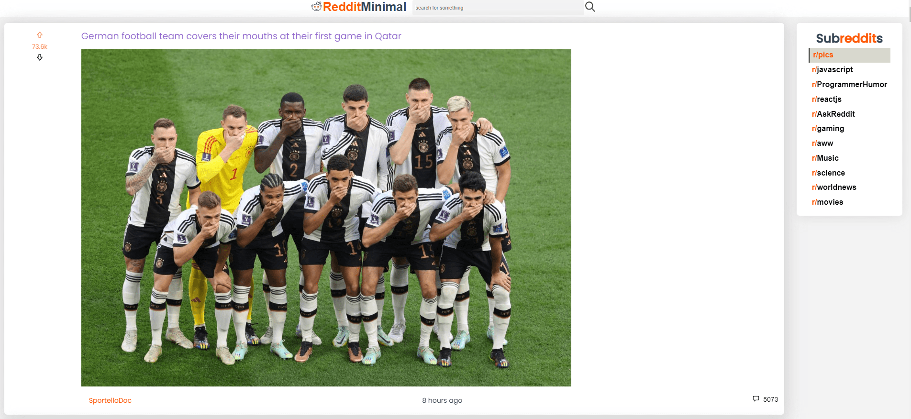

# [RedditMinimal Client](https://ak-reddit-minimal.netlify.app/)

This project was completed as the final project for the Front End Development section of [Codecademy Full-Stack Software Engineer Career Path](https://www.codecademy.com/learn/paths/full-stack-engineer-career-path)

The live project can be **[viewed here](https://ak-reddit-minimal.netlify.app/)**

  

  

## Table of Content
1. [Purpose](#purpose)
2. [Technology Used](#technology-used)
3. [Features](#features)
4. [App Architecture](#app-architecture)
5. [Contribute](#contribute)
6. [Acknowledgements](#acknowledgements)
7. [License](#license)

## Purpose
## Technology Used
## Features
## App Architecture
## Contribute
## Acknowledgements
## License