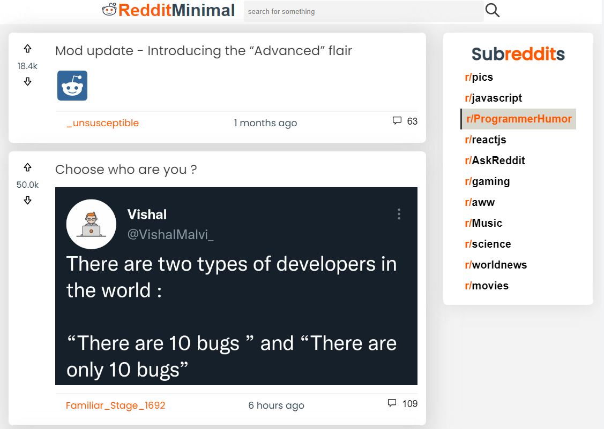

# [RedditMinimal Client](https://ak-reddit-minimal.netlify.app/)

This project was completed as the final project for the Front End Development section of [Codecademy Full-Stack Software Engineer Career Path.](https://www.codecademy.com/learn/paths/full-stack-engineer-career-path)

The live project can be **[viewed here.](https://ak-reddit-minimal.netlify.app/)**

  
 
*the author of this project asserts this project has less than 10 bugs - he hopes =)*
  

## Table of Contents
1. [Purpose](#purpose)
2. [Technology Used](#technology-used)
3. [Features](#features)
4. [App Architecture](#app-architecture)
5. [Contribute](#contribute)
6. [Acknowledgements](#acknowledgements)
7. [License](#license)

## Purpose

The purpose of this project was to test the material covered in [Codecademy Full-Stack Software Engineer Career Path.](https://www.codecademy.com/learn/paths/full-stack-engineer-career-path).

This projected integrated both technical and conceptual knowledge related to modern front end application development.

Concepts tested include:

- Project wireframing
- Project planning, background research, and organization
- Version control
- Manual testing
- Automated testing
- Visual design
- Deploying web apps
- Continuous integration and continous deployment

## Technology Used

**Development:**

- HTML5
- CSS3
- Javascript (ES6)
- ReactJS
- Redux

**Automated Testing:**
- Jest
- React Testing Library

**Version Control:**
- Git

**Hosting & CI/CD:**
- GitHub
- Netflify

## Features

**Feeds**

- Loads to a default feed with 25 posts
- Subreddit for default feed is r/pics
- User is able to choose a new subreddit from "Subreddits" menu on right side of screen (large displays) or on top of feed (small displays)
- When new subreddit is chosen, feed updates to 25 new posts from that subreddit
- Posts in the feed can be filtered using the search bar in the header. 
- Partial matching for search terms is possible - i.e. the search "new javascript" would match  both of these posts: "What are the new javascript ES6 features" and "10 things all new javascript developers should know"
- Searches are case sensitive

**Posts**

- Each Post card displays the following information about the post:
    - Current vote total (calculated as upvotes - downvotes)
    - Title
    - Post Author
    - Number of comments
    - Time since post 
        - in hours if less than 1 day 
        - in days if less than 1 week 
        - in weeks if less than 1 month
        - in months if less than 1 year
        - in years if more than 1 year

 

- Clicking the post title or preview image will open the posts permalink url in a new tab 
    - for image type posts this will be full size image
    - for discussion type posts, this will be the comments link in reddit

- Clicking the comments icon (bottom right part of post card) will display the top 5 comments
    - Only the comment itself will be displayed, not replies to the comment
    - Comment author is displayed
    - Time since comment displayed, using same formatting logic as posts

## App Architecture

**Diagram**

**Getting Data**

This app uses the [Reddit JSON API](https://github.com/reddit-archive/reddit/wiki/JSON) in order to fetch data from Reddit.

The Reddit JSON API is a simplied API which does not require OAuth, and only allows GET requests. As such no ability to send data to the reddit servers (i.e. upvotes, comments, sign ins etc) are available.

Based on user actions, requests to different endpoints are sent via Javascripts [fetch API.](https://developer.mozilla.org/en-US/docs/Web/API/Fetch_API)

Data is stored in different slices of state which are ultimately sent to the top-level Redux store. This state management pattern is from [Redux Toolkit.](ttps://redux-toolkit.js.org)

**Fetching Posts**

- On initial page load, a request is sent to `https://www.reddit.com/r/pics.json` and the returned object is parsed to JSON and used to populate the `posts` property in the `redditSlice` of state.
- On clicking a subreddit, a new request is sent to `https://www.reddit.com/${selectedSubreddit}.json` where `${selectedSubreddit}` is the title of the subreddit clicked (i.e. /r/javascript). This new response objects data is then parsed and replaces the old data in the `posts` property in `redditSlice`.

**Fetching Comments**

 - Comments are loaded only when needed, on initial page load no comments are loaded for any of the posts
 - When a `Post` cards comments button is clicked, a request is sent to  `https://www.reddit.com${permalink}/.json?limit=20` where `${permalink}` is a prop on the `post` component (passed to it when rendered by the `Posts` component, which in turn gets it from the `redditSlice` of state)
 - Each comment comes with other data we do not need, so we extract the data we care about, and throw out the rest. This is why `limit=20` gives 5 comments - the resonse object has 3 keys we don't need per comment.
 - The comment array is saved in local state within the `Post` component. This local state varibale is mapped to render the `Comments` component.

## Contribute

If you would like to improve this project, you may submit [pull requests here.](https://github.com/YSquid/reddit-minimal/pulls).

If you would like to connect with me re: this project you can reach me at:
- Email: [ahmad.k@ysquid.tech](mailto:ahmad.k@ysquid.tech)
- Linked: [Ahmad Kariem](https://www.linkedin.com/in/ahmad-kariem/)

## Acknowledgements
## License